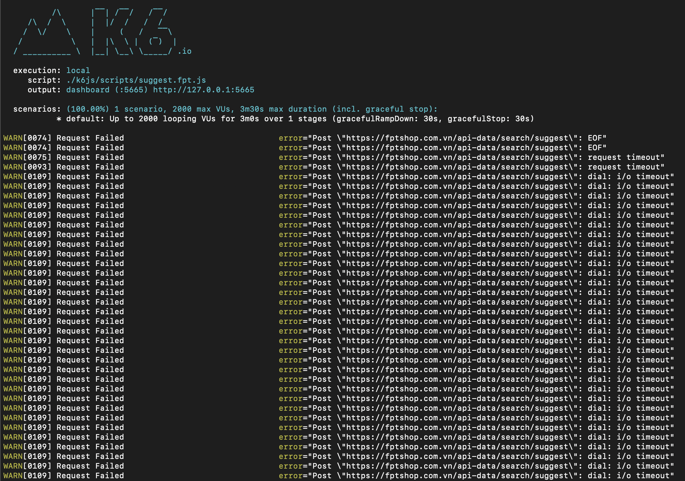
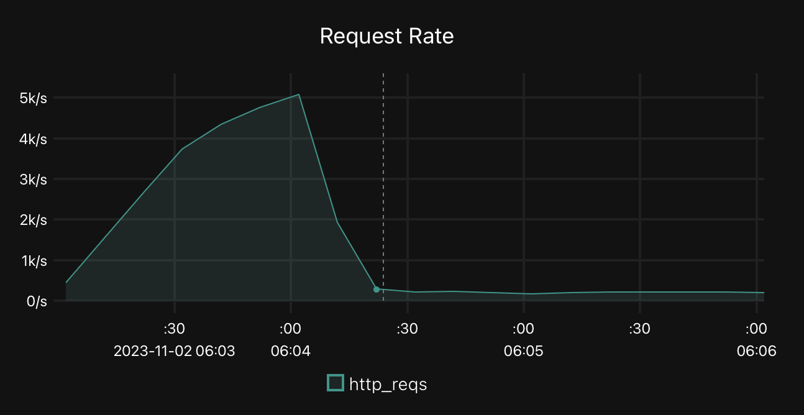
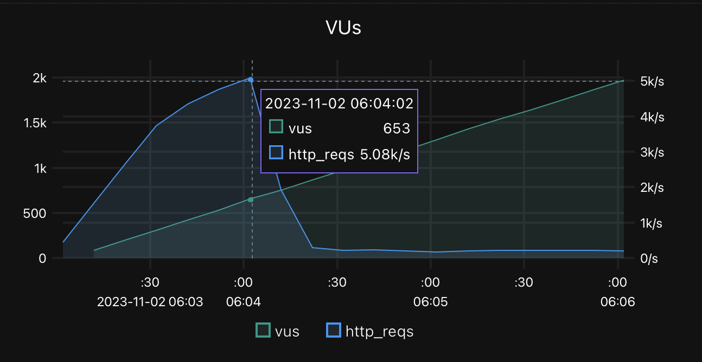

# Breakpoint testing
## # what?
- Breakpoint testing aim to find system litmit. The reason you might want to know may include: 
1. To tune or care for the system's weak spot to relocate those higher limit at higher levels
2. To help plan remediation steps in those case and prepare for when the system near those limits

- Breakpoint testing is also called `capacity`, `point load` or `limit` testing.

- A breakpoint ramps to unrealistically high numbers. This test commonly has to be stopped manually or automatically as thresholds start to fail. 


## # When?
Teams execute a breakpoint test whenever they must know their system's diverse limits. Some conditions that may warrant a breakpoint test include the following:
1. The need to know if the system's load expects to grow continuously
2. If current resource consumption is considered high
3. After significant changes to the code-base or infrastructure.

How often to run this test type depends on the risk of reaching the system limits and the number of changes to provision infrastructure components.

Once the breakpoint runs and the system limits have been identified, you can repeat the test after the tuning exercise to validate how it impacted limits. Repeat the test-tune cycle until the team is satisfied.

## # Considerations
1. Avoid breakpoint tests in elastic cloud environments.
> The elastic environment may grow as the test moves further, finding only the limit of your cloud account bill. If this test runs on a cloud environment, turning off elasticity on all the affected components is strongly recommended.
2. Increase the load gradually.
> A sudden increase may make it difficult to pinpoint why and when the system starts to fail.

3. System failure could mean different things to different teams
> You might want to identify each of the following failure points:
> - Degraded performance. The response times increased, and user experience decreased.
> - Troublesome performance. The response times get to a point where the user experience severely degrades.
> - Timeouts. Processes are failing due to extremely high response times.
> - Errors. The system starts responding with HTTP error codes.
> - System failure. The system collapsed.

4. You can repeat this test several times
> Repeating after each tuning might let the you push the system further.

5. Run breakpoints only when the system is known to perform under all other test types.
> The breakpoint test might go far if the system performs poorly with the previous testing types.

## # How?
In k6, define option config as following:
- Load slowly ramps up to a considerably high level. 
> We can increase VUs or throughput.
- It has no plateau, ramp-down, or other steps.
- Define threshold for automatically stop the test or you can stop it manually.
```js
export const options = {
  // Key configurations for breakpoint in this section
  executor: 'ramping-arrival-rate', //Assure load increase if the system slows
  stages: [
    { duration: '2h', target: 20000 }, // just slowly ramp-up to a HUGE load
  ],
    threshold: {
        'http_req_failed': ['rate<0.1'], // Rate: http errors should be less than 10%
        'Errors': ['count<100'],  // Count: Incorrect content cannot be returned more than 99 times.
    }
};
```
## # Result analysis
- A breakpoint test must cause system failure. 
- The test helps identify the failure points of our system and how the system behaves once it reaches its limits.
- Once the system limits are identified, the team has two choices: accept them or tune the system.

If the decision is to accept the limits, the test results help teams prepare and act when the system is nearing such limits. 
> The actions could be:
> - Prevent reaching such limits
> - Grow system resources
> - Implement corrective actions for the system behavior at its limit
> - Tune the system to stretch its limits

If the action taken is to tune the system, tune, then repeat the breakpoint test to find where and whether the system limits moved.

A team must determine the number of repetitions of the breakpoint test, how much the system can be tuned, and how far its limits can be tuned after each exercise.

#### A sample run:
Setting with 3m ramp-up to 2000 VUs
- The terminal show alot failed requests start from sec 74th to the end

- Request rate is down to about half of the starter's rate.


- VUs & Request_rate Chart shows the peaks is about over 5k request with 653 users


*[Summary report](/results/k6%20report%20@breakpoint.html)*