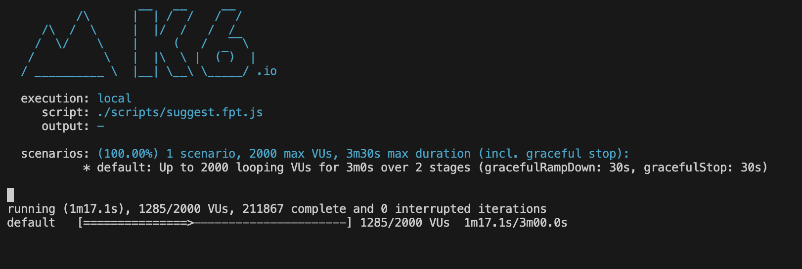
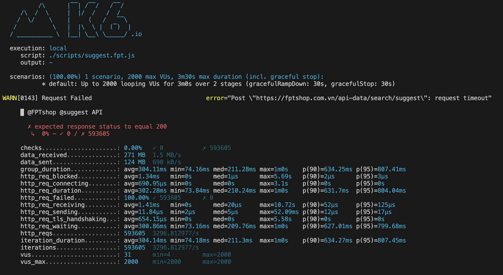
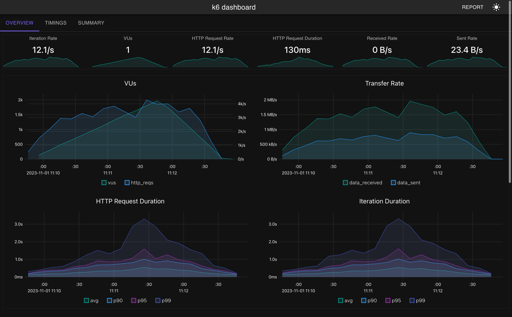

## # What is Spike load test?
- Spike load test verified whether the system survives and performs under sudden and massive rushes of utilization.
> sample reality scenarios may include ticket sales (Taylor Swift), product launches (PS5), broadcast ads (Super Bowl), process deadlines (tax declaration), and seasonal sales (Black Friday).

## # How to do?
- Spike test inscreases to extremely high load in very short or non existance ramp-up time. The ramp-down period is also very short or even like not exist.
> This processs describes how real users process the system, they quickly rise and fall in unstable condition, and pretend not to process any extra action when system is not stable.


## # When using?
- System expect to receive a sudden rush of activity.
> we can see how system perform in such scenarios

## # Considerable
- Focus on key processess of test types
> Assess whether the spike in traffic triggers the same or different processes from the other test types. Create test logic accordingly.

- The test often won't finish.
> Errors are common under these scenarios.

- Run, tune, repeat
> When your system is at risk of spike events, the team must run a spikes test and tune the system several times.

- Monitor
> Backend monitoring is a must for successful outcomes of this test

## # Results analysis
- Some metric should be brought into business:
1. `pod speed`: this could describe the `pod` (a single processing unit in Kubernates) prcoessing speed when entire system encounter a sudden rise of activities.
2. `recovery time` after the load rush: it describe how long the system recover to the normal perfomance after the sudden load.  
3. `behaviour of the system`: this metric is the monitoring process entire the system when doing spike test help finding the bottleneck or the weak spot of the system.

#### # k6 run sample:
- run: 
```cmd
$ k6 run --config ./configs/spike.config.json ./scripts/suggest.fpt.js
```
- process should be like:


- results:


- html report: 
